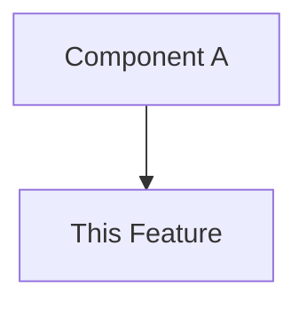

# Blueprint: [Feature Name]

## 1. Goal
[Briefly describe what this feature achieves and its business value.]

## 2. System Context
[Describe where this feature fits in the overall system. A Mermaid diagram is recommended.]



## 3. Architecture & Design
### 3.1 Components
- **[Component Name]**: [Description]

### 3.2 Data Flow
1. [Step 1]
2. [Step 2]

## 4. API / Interfaces
### [Method/Endpoint Name]
- **Input**: `[Type]`
- **Output**: `[Type]`

## 5. Data Models
```typescript
interface Example {
  field: string;
}
```

## 6. Implementation Plan
- [ ] Step 1
- [ ] Step 2
